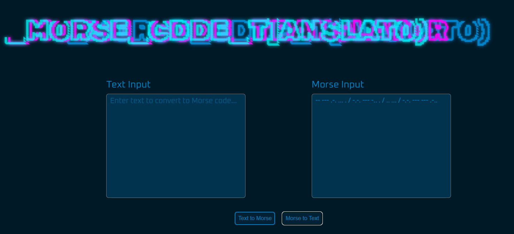
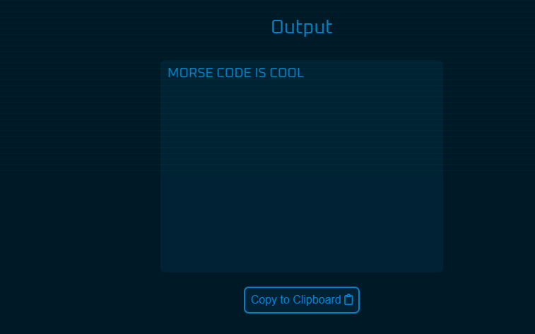

# Greetings and bienvenue 🦇

Have you ever found some weird looking text that contained just two characters; a dot ( . ) and a dash ( - )? That right there my friend, is known as Morse Code 📖.

Ever wanted to know what that means? Well say no more as you've come to the right place. Here you'll find a simple yet robust translator 🧐 tool that gives you exactly what you want, translating from and to morse code.

Just head over to the link and you can get started translating all the Morse Code you could ever want.
## Tech Stack

**Client:** All of this was lovingly built with vanilla HTML, CSS and JavaScript.

## Screenshots

### Inputting morse code

### Resulting output

